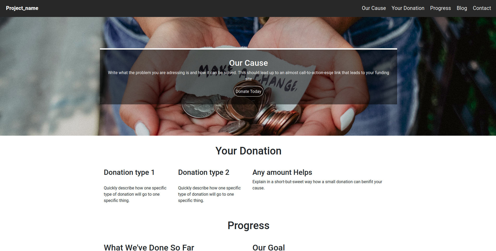

## Donation and Blog
--
This is open-source software aimed towards good causes and charites. It features a donation api, blog, and beaufitul landing page to overview a project.
 

 
#INSTRUCTIONS FOR DEPLOYMENT
 
Run these to get the project up and running!
<ol>
    <li><code>composer install</code></li>
    <li><code>./artisan view:cache</code></li>
    <li><code>./artisan key:generate</code></li>
    <li><code>cp .env.example .env</code></li>
    <li>Edit the .env file to match your server requirements. This should be as easy as entering a database name</li>
    <li><code>./artisan migrate</code></li>
    <li><code>./artisan serve</code></li>
</ol>
And that's it! Your project is now running at <a href="http://localhost:8000">localhost:8000</a>